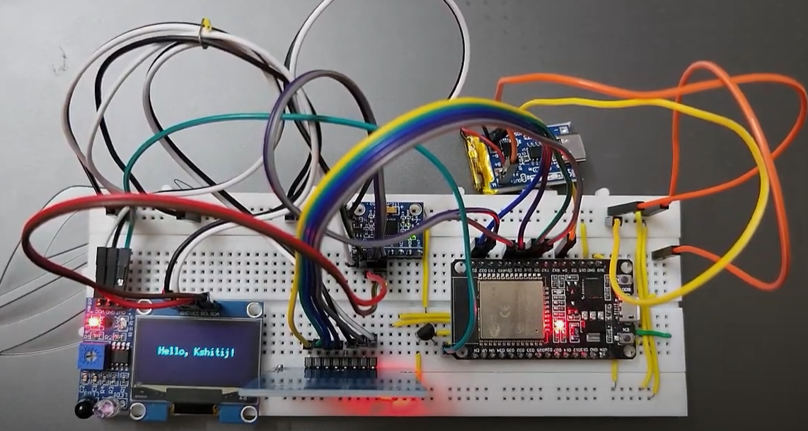

# ESP32 Smartwatch Prototype

This project is a smartwatch prototype built using an ESP32 microcontroller. It features a clock, temperature sensor, weather information, smart attendance system, and a pedometer.

## Table of Contents

- [ESP32 Smartwatch Prototype](#esp32-smartwatch-prototype)
  - [Table of Contents](#table-of-contents)
  - [Demo](#demo)
  - [Features](#features)
  - [Hardware Requirements](#hardware-requirements)
  - [Software Setup](#software-setup)
  - [Usage](#usage)
  - [PCB Design](#pcb-design)
  
## Demo

Check out our [demo video](https://drive.google.com/file/d/1fcW_Oc4n3bDvE3uNK7-zcu651_ghdU1P/view?usp=sharing) to see the smartwatch prototype in action!

## Features

- Real-time clock display
- Temperature sensing
- Weather information retrieval
- Smart attendance system using RFID
- Pedometer for step counting
- OLED display for user interface

## Hardware Requirements

- ESP32 development board
- OLED display (SH1106 128x64)
- LM35 temperature sensor
- IR sensor
- MFRC522 RFID module
- MPU6050 accelerometer
- Miscellaneous: resistors, capacitors, wires

## Software Setup

1. Install [PlatformIO](https://platformio.org/) in your preferred IDE (e.g., VS Code).
2. Clone this repository: `git clone https://github.com/yourusername/esp32-smartwatch.git`
3. Open the project in PlatformIO.
4. Update the `platformio.ini` file with your board configuration if necessary.
5. Install the required libraries listed in the `platformio.ini` file.

## Usage

1. Connect the ESP32 and components according to the wiring diagram.
2. Update the Wi-Fi credentials and OpenWeatherMap API key in `src/weather.cpp`.
3. Compile and upload the code to your ESP32 board.
4. Power on the device and interact with it using the IR sensor for navigation.

## PCB Design

The PCB design files for this project can be found in the `pcb/` directory:

- [Schematic (PDF)](pcb/Schematic.pdf)
- [3D Image](pcb/3D.png)

